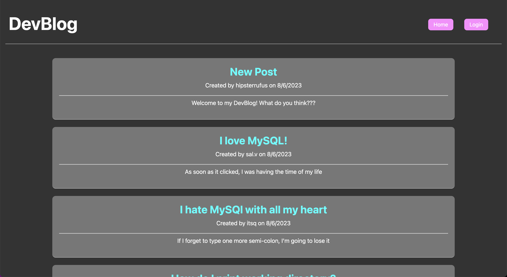

# silver-happiness-14

## Description
The Module 14 Challenge combines the knowledge and understanding of all backend technologies to create a CMS-style blog for developers from scratch

## Usage
To use this website, click on the link below:   
[DevBlog](https://hipster-rufus.github.io/silver-happiness-14)  

DevBlog displays the most recent blog posts from all users. To create a post, one must simply create a user profile by signing up, which will then redirect them to their personalized dashboard. From there the user can create and delete their own posts. By clicking on the link to a post, the user is presented with the option to leave a comment. 

## Credits
The following websites were used to generate this project:

[Professional README.md Guide](https://coding-boot-camp.github.io/full-stack/github/professional-readme-guide)

[CSS Styling](https://www.w3schools.com/css/)

[Bootstrap Docs](https://getbootstrap.com/docs/)

[W3 JS Tutorials](https://www.w3schools.com/js)

[GitLab DU Repo](https://git.bootcampcontent.com/University-of-Denver/DU-VIRT-FSF-PT-02-2023-U-LOLC)

## License
None.